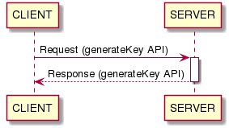
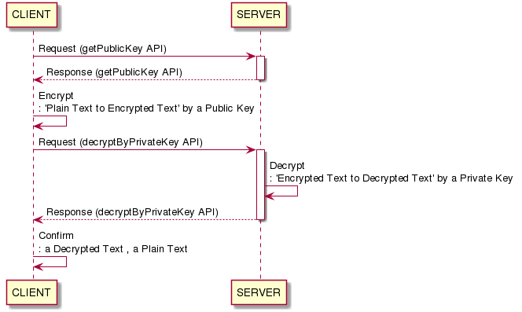
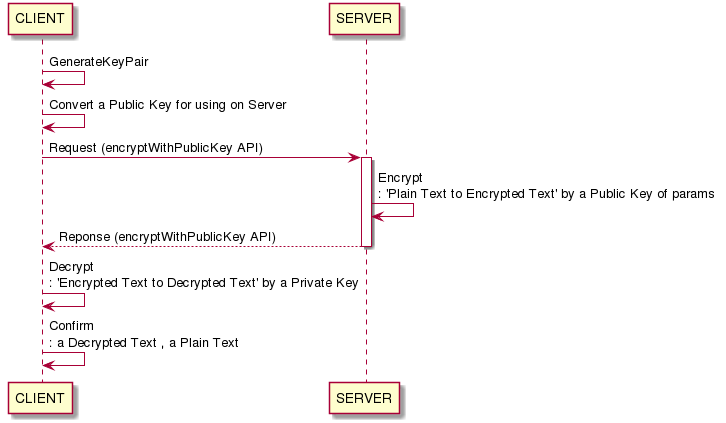

# RSAClient-iOS

## CLIENT
- iOS
- Objective-c
- RSA Encrypt/Decrypt UnitTests

## SERVER
- https://github.com/tigi44/RSAServer-SpringBoot

## Sequence diagram
### testSendRequestForGeneratingKey

### testEncryptionByServerPublicKey

### testDecryptionByiOSPrivateKey

# Reference
- https://github.com/ideawu/Objective-C-RSA
- https://blog.wingsofhermes.org/?p=42
